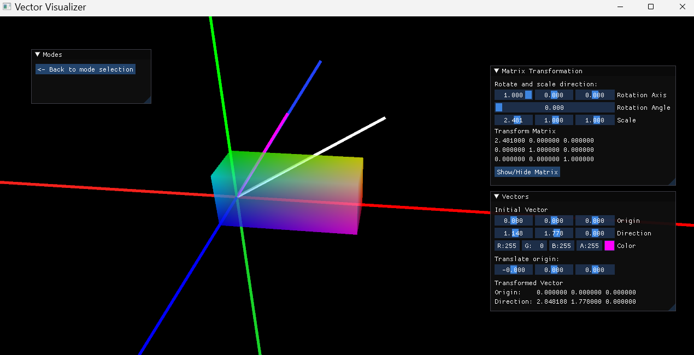
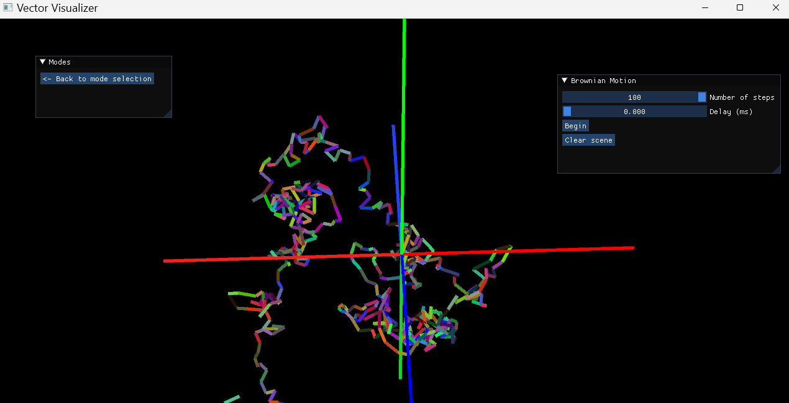

# Vector-Visualizer

## Summary
This software is a tool for visualizing vectors and matrix transformations

## Gallery

### Matrix Transformation

> Sample matrix transformation applied to vector, showing the axes, pre-transform vector, post-transform vector, and the matrix volume

### Brownian Motion

> Sample Brownian motion with 500 steps